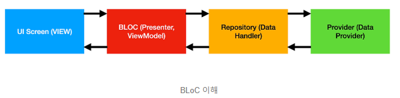

# bloc_test

state management: BLoC(Business Logic Component)

출처: https://totally-developer.tistory.com/82 [Totally 개발자:티스토리]

## Getting Started

This project is a starting point for a Flutter application.

A few resources to get you started if this is your first Flutter project:

- [Lab: Write your first Flutter app](https://docs.flutter.dev/get-started/codelab)
- [Cookbook: Useful Flutter samples](https://docs.flutter.dev/cookbook)

For help getting started with Flutter development, view the
[online documentation](https://docs.flutter.dev/), which offers tutorials,
samples, guidance on mobile development, and a full API reference.

## Features

https://jsonplaceholder.typicode.com/albums 
이 예제 json url를 사용하여 데이터를 불러오고 화면에 출력한다.

## Skill

state management: BLoC

## Plugin(pub.dev)

dependencies:
  rxdart: ^0.28.0
  http: ^1.3.0
  get_it: ^8.0.3

## prior knowledge

### 의존성 주입(Dependency Injection): 
GetIt을 사용하여 의존성을 주입하는 것은, 코드의 결합도를 낮추는 데 매우 효과적입니다. 
main.dart는 AlbumBloc, AlbumRepository, AlbumApiProvider의 구현에 대해 알 필요 없이, 
GetIt을 통해 필요한 인스턴스를 제공받을 수 있습니다.

### 캡슐화(Encapsulation): 
albums_model.dart와 album_model.dart는 API 응답 데이터를 모델링하는 데만 집중합니다. 
api_provider.dart는 API 호출과 응답 데이터 처리, 모델 변환 등에만 집중합니다. 
각 파일의 역할을 명확하게 분리하는 것은 좋은 프로그래밍 습관입니다.

### 관심사 분리(Separation of Concerns): 
각 파일이 자신의 역할에만 집중하도록 설계하는 것은 코드의 가독성, 재사용성, 유지보수성을 크게 향상시킵니다.

### BLoC(Business Logic Component)

> 상태 관리 패턴 중 하나인 BLoC(Business Logic Component)에 대해 자세히 설명해줘

BLoC는 앱의 UI(View)와 비즈니스 로직(Business Logic)을 분리하여, 
상태를 예측 가능하게 관리하고, 코드의 재사용성과 테스트 용이성을 높이는 데 중점을 둔 상태 관리 패턴입니다.


- Provider (Data Provider): 데이터 제공 및 수집, 데이터 처리
- Repository (Data Handler): Data Provider에서 제공 받은 데이터를 필터링 등 변형하여 BLOC에게 데이터를 제공
- BLOC (Presenter, ViewModel): Business Logic을 담은 패키지로, 화면에 적용시킬 수 있도록 stream을 통해 add하여 화면에 반영할 수 있도록 함
- UI Screen (View): initState로 초기 데이터를 먼저 받아오고 추후 stream을 통해 계속 데이터를 갱신해서 가져올 수 있음

### main.dart의 역할: main.dart는 애플리케이션의 진입점이며, 주로 다음과 같은 역할을 합니다.
- GetIt 초기화 및 의존성 등록 (AlbumBloc, AlbumRepository, AlbumApiProvider 등)
- 최상위 위젯 (MyApp) 구성 및 실행
- 그 외 애플리케이션의 전반적인 설정 및 초기화


## Layout

- AlbumView, ListView

## Setps

album_model -> albums_model -> album_provider(http) -> album_repository -> album_bloc(stream) -> album_view -> main

### json data
https://jsonplaceholder.typicode.com/albums
```json
[
  {
    "userId": 1,
    "id": 1,
    "title": "quidem molestiae enim"
  },
  {
    "userId": 1,
    "id": 2,
    "title": "sunt qui excepturi placeat culpa"
  }
]
```

### implement album_model, albums_model

- /lib/models/album_model.dart
```dart
class Album {
  int? userId;
  int? id;
  String? title;

  Album({this.userId, this.id, this.title});

  factory Album.fromJson(Map<String, dynamic> json) =>
      Album(userId: json['userId'], id: json['id'], title: json['title']);
}
```

- /lib/models/albums_model.dart
```dart
import 'package:bloc_test/models/album_model.dart';

class Albums {
  late List<Album> albums;

  Albums({required this.albums});

  Albums.fromJson(List<dynamic> json)
      : albums = json.map((item) => Album.fromJson(item)).toList();
}
```


### implement album_provider

AlbumApiProvider → http.Client: AlbumApiProvider는 HTTP 요청을 보내기 위해 http 패키지의 Client를 사용합니다. 
따라서 AlbumApiProvider는 http.Client에 의존합니다.

- AlbumsModel을 사용하여 데이터를 가져옵니다.
- static으로 클라이언트를 관리하던 것을 클라이언트에서 생성합니다.

- /lib/providers/album_provider.dart
```dart
import 'dart:convert';

import 'package:bloc_test/models/albums_model.dart';
import 'package:http/http.dart' show Client;

class AlbumApiProvider {
  // static 변수로 선언하여 한 번만 생성
  static final Client _client = Client();
  static const String _baseUrl = 'https://jsonplaceholder.typicode.com';
  static const String _albumsEndpoint = '/albums';

  // static을 사용하는 경우
  // static Future<Albums> fetchAlbums() async {
  //   return await _fetchAlbums(_client);
  // }

  // static을 사용하지 않는 경우
  // AlbumApiProvider를 사용하는 측에서 Client 객체를 생성해야 합니다.
  Future<Albums> fetchAlbums(Client client) async {
    return await _fetchAlbums(client);
  }

  Future<Albums> _fetchAlbums(Client client) async {
    final url = '$_baseUrl$_albumsEndpoint';
    final uri = Uri.parse(url);

    final response = await client.get(uri);
    // 요청 실패하는 경우
    if (response.statusCode != 200) {
      // 서버에서 발생한 에러
      if (response.statusCode >= 500) {
        throw Exception('Failed to load albums: Server Error');
      }
      // 클라이언트에서 발생한 에러
      else if (response.statusCode >= 400) {
        throw Exception('Failed to load albums: Client Error');
      }
      // 그외 에러
      else {
        throw Exception(
          'Failed to load albums: status code ${response.statusCode}',
        );
      }
    }

    // jsonDecode에 문제가 발생하는 경우
    try {
      final data = jsonDecode(response.body) as List<dynamic>;
      return Albums.fromJson(data);
    } on FormatException catch (e) {
      throw Exception('Invalid data format: $e');
    }
  }
}

```

### implement album_repository

AlbumRepository → AlbumApiProvider: AlbumRepository는 실제 API 호출을 위해 AlbumApiProvider의 fetchAlbums() 메서드를 호출합니다. 
따라서 AlbumRepository는 AlbumApiProvider에 의존합니다.

- AlbumApiProvider를 주입받아 사용합니다.
- fetchAllAlbums() 메서드에서 _apiProvider.fetchAlbums()를 호출합니다.
- Client를 직접 생성하도록 수정합니다.

- /lib/repositories/album_repository.dart
```dart
import 'package:bloc_test/models/albums_model.dart';
import 'package:bloc_test/providers/api_provider.dart';
import 'package:http/http.dart' show Client;

/// AlbumApiProvider를 사용하여 데이터를 가져옵니다.
class AlbumRepository {
  final AlbumApiProvider _apiProvider;

  AlbumRepository(this._apiProvider);

  Future<Albums> fetchAllAlbums() async {
    // static을 사용하지 않기 때문에 Client를 넘겨주어야 합니다.
    final client = Client();
    try {
      return await _apiProvider.fetchAlbums(client);
    } finally {
      client.close();
    }
  }
}

```

### implement album_bloc

AlbumBloc → AlbumRepository: AlbumBloc은 데이터를 가져오기 위해 AlbumRepository의 fetchAllAlbums() 메서드를 호출합니다. 
따라서 AlbumBloc은 AlbumRepository에 의존합니다.

- AlbumRepository를 생성자를 통해 주입받습니다.
- _albumRepository.fetchAllAlbums()를 호출하여 데이터를 가져옵니다.

- /lib/bloc/album_bloc.dart
```dart
import 'package:bloc_test/models/albums_model.dart';
import 'package:bloc_test/repositories/album_repository.dart';
import 'package:rxdart/rxdart.dart';

class AlbumBloc {
  final AlbumRepository _albumRepository = AlbumRepository();
  final PublishSubject<Albums> _albumsSubject = PublishSubject<Albums>();

  Stream<Albums> get allAlbumsStream => _albumsSubject.stream;

  Future<void> fetchAllAlbums() async {
    try {
      final albums = await _albumRepository.fetchAllAlbums();
      _albumsSubject.sink.add(albums);
    } catch (e) {
      _albumsSubject.addError(e);
    }
  }

  void dispose() {
    _albumsSubject.close();
  }
}
```

### implement album_view

- /lib/views/album_view.dart
```dart
import 'package:bloc_test/bloc/album_bloc.dart';
import 'package:bloc_test/models/albums_model.dart';
import 'package:flutter/material.dart';
import 'package:get_it/get_it.dart';

class AlbumView extends StatefulWidget {
  const AlbumView({super.key});

  @override
  State<AlbumView> createState() => _AlbumViewState();
}

class _AlbumViewState extends State<AlbumView> {
  late final AlbumBloc _albumBloc;

  @override
  void initState() {
    super.initState();
    _albumBloc = GetIt.I<AlbumBloc>();
    _albumBloc.fetchAllAlbums();
  }

  @override
  Widget build(BuildContext context) {
    return Scaffold(
      appBar: AppBar(title: const Text('Albums')),
      body: StreamBuilder<Albums>(
        stream: _albumBloc.allAlbumsStream,
        builder: (context, snapshot) {
          if (snapshot.hasData) {
            final albumList = snapshot.data!;
            return ListView.builder(
              itemCount: albumList.albums.length,
              itemBuilder: (context, index) {
                final album = albumList.albums[index];
                return ListTile(
                  title: Text('Album Title: ${album.title}'),
                  subtitle: Text('Album ID: ${album.id}'),
                  contentPadding: const EdgeInsets.all(10),
                );
              },
            );
          } else if (snapshot.hasError) {
            return Center(
              child: Text(
                'Error: ${snapshot.error}',
                style: const TextStyle(color: Colors.red),
              ),
            );
          } else {
            return const Center(
              child: CircularProgressIndicator(strokeWidth: 2),
            );
          }
        },
      ),
    );
  }
}
```

### implement main

- AlbumRepository를 GetIt에 등록합니다.
- AlbumBloc을 등록할 때 AlbumRepository를 주입합니다.
- AlbumRepository를 등록할 때 AlbumApiProvider를 주입합니다.

```dart
import 'package:bloc_test/bloc/album_bloc.dart';
import 'package:bloc_test/providers/api_provider.dart';
import 'package:bloc_test/repositories/album_repository.dart';
import 'package:bloc_test/views/album_view.dart';
import 'package:flutter/material.dart';
import 'package:get_it/get_it.dart';

void setupGetIt() {
  // AlbumApiProvider를 싱글톤으로 등록합니다.
  GetIt.I.registerSingleton<AlbumApiProvider>(AlbumApiProvider());
  // AlbumRepository 등록: AlbumRepository를 등록할 때 AlbumApiProvider를 주입합니다.
  GetIt.I.registerFactory<AlbumRepository>(
            () => AlbumRepository(GetIt.I.get<AlbumApiProvider>()),
  );
  // AlbumBloc을 팩토리로 등록합니다.: AlbumBloc을 등록할 때 AlbumRepository를 주입합니다.
  GetIt.I.registerFactory<AlbumBloc>(
            () => AlbumBloc(GetIt.I.get<AlbumRepository>()),
  );
}

void main() {
  // GetIt 초기화
  setupGetIt();
  runApp(const MyApp());
}

class MyApp extends StatelessWidget {
  const MyApp({super.key});

  @override
  Widget build(BuildContext context) {
    return MaterialApp(
      home: AlbumView(),
    );
  }
}
```
