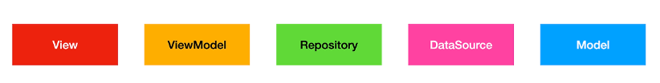

# mvvm_provider_test

A new Flutter project.

MVVM architecture, using Provider, Dependency Injection

- 출처: https://totally-developer.tistory.com/115 [Totally 개발자:티스토리]

## Getting Started

This project is a starting point for a Flutter application.

A few resources to get you started if this is your first Flutter project:

- [Lab: Write your first Flutter app](https://docs.flutter.dev/get-started/codelab)
- [Cookbook: Useful Flutter samples](https://docs.flutter.dev/cookbook)

For help getting started with Flutter development, view the
[online documentation](https://docs.flutter.dev/), which offers tutorials,
samples, guidance on mobile development, and a full API reference.


## Features

- MVVM architecture sample, using Provider, Dependency Injection
- https://jsonplaceholder.typicode.com/albums 이 예제 json url를 사용하여 데이터를 불러오고 화면에 출력한다.

## Usage


## Skill

Provider

## Plugin(pub.dev)

- provider: ^6.1.2
- http: ^1.3.0

## prior knowledge



| Component  | Description                             |
|:-----------|:----------------------------------------|
| View       | 사용자에게 보여지는 영역                           |
| ViewModel  | View의 상태를 관리하고 View의 비즈니스 로직을 담당        |
| Repository | 데이터 저장소라는 뜻으로 DataLayer인 DataSource에 접근 |
| DataSource | 데이터를 가져오는 영역(API, 로컬 DB)                |
| Model      | 데이터 설계                                  | 


### DataSource와 Service 비교

- `Service는 "비즈니스 로직"을 담당하고, DataSource는 "데이터 저장소"와 직접 통신하는 역할을 한다!`
- Service는 여러 DataSource에서 데이터를 가져와 가공하는 역할
- DataSource는 특정 데이터 저장소(API, DB 등)와 직접적으로 연결되어 데이터 CRUD를 수행

### 의존성 주입(Dependency Injection, DI)의 종류
의존성을 주입하는 방법은 크게 세 가지로 나눌 수 있습니다.
1. 생성자 주입(Constructor Injection): 생성자를 통해 의존 객체를 주입하는 방식입니다. 일반적으로 가장 많이 사용되며, 의존성이 필수적일 때 사용합니다.
2. Setter 주입(Setter Injection): Setter 메서드를 통해 의존 객체를 주입하는 방식입니다. 의존성이 선택적일 때 사용합니다.
3. 인터페이스 주입(Interface Injection): 인터페이스를 통해 의존 객체를 주입하는 방식입니다.

### AlbumViewModel 예시에서 의존성 주입이 어떻게 적용되었나?
```dart
class AlbumViewModel extends ChangeNotifier {
 final AlbumRepository _albumRepository;

 // 생성자에서 AlbumRepository를 주입 받음
 AlbumViewModel({required AlbumRepository albumRepository}) : _albumRepository = albumRepository;

// ... (나머지 코드)
}
```

위 코드에서 다음 사항을 확인할 수 있습니다.
1. AlbumRepository 의존성: AlbumViewModel은 AlbumRepository에 의존합니다. 즉, AlbumRepository 없이는 앨범 목록을 가져올 수 없습니다.
2. 생성자 주입: AlbumViewModel의 생성자(AlbumViewModel({required AlbumRepository albumRepository}))에서 AlbumRepository를 필수로 주입받도록 구현되어 있습니다. 이는 생성자 주입 방식입니다.
3. 외부에서 생성된 객체 주입: AlbumViewModel 내부에서 AlbumRepository 객체를 직접 생성하는 것이 아니라, 외부에서 생성된 AlbumRepository 객체를 생성자를 통해 전달받습니다.
4. 의존성 사용: AlbumViewModel에서는 주입 받은 _albumRepository를 사용하여 getAlbumList를 가져옵니다.


### main.dart에서 의존성 주입이 어떻게 사용되었나?

```dart
home: ChangeNotifierProvider(
    create: (_) => AlbumViewModel(albumRepository: AlbumRepository()),
    child: const AlbumView(),
  ),
```

1. AlbumViewModel 객체를 생성할 때, AlbumRepository() 객체를 직접 생성하여 AlbumViewModel 생성자의 인자로 전달합니다.
2. AlbumViewModel에서는 생성자를 통해 전달받은 albumRepository객체를 사용하게 됩니다.

### getAlbumList vs. fetchAlbums 변수명 선택 기준

 - fetchAlbums    
   - AlbumDataSource는 외부 데이터 소스 (예: API)를 호출하고, 응답을 파싱하여 앨범 목록을 가져옵니다. 
   - 즉, 외부 데이터 소스와 관련된 구체적인 작업을 수행합니다. 
   - 따라서 fetchAlbums()와 같이 외부 데이터 소스로부터 데이터를 가져오는 행위를 명확히 나타내는 메서드 이름을 사용하는 것이 적절합니다.
   1. "fetch"는 보통 네트워크나 데이터베이스 등 외부에서 데이터를 가져오는 행위에 초점을 맞추고 있습니다.
   2. "get"은 이미 가지고 있는 데이터를 반환한다는 뉘앙스를 줍니다. (로컬 캐시나 메모리 등에서)

 - getAlbumList
   - AlbumRepository는 데이터를 제공하는 역할을 담당합니다. 
   - AlbumRepository는 데이터를 어떤 방식으로 가져오는지는 추상화하고 있습니다.
   - 즉, AlbumRepository를 사용하는 쪽에서는 데이터가 어디에서 어떻게 오는지 알 필요 없이, 단순히 getAlbumList() 메서드를 통해 앨범 목록을 요청하면 됩니다. 
   - 따라서 getAlbumList()는 데이터를 가져오는 행위보다는 데이터를 얻는다는 추상적인 개념을 나타내는 것이 적절합니다.
   1. "앨범 목록을 얻는다"라는 추상적인 행위를 나타내므로 'fetch'가 아닌 'get'을 사용하였음   
 
 - AlbumRepository는 getAlbumList라는 추상적인 메서드를 사용(데이터가 어디서 어떻게 오는지 알 필요 없음)하고,
 - AlbumDataSource는 fetchAlbums와 같이 구체적인 데이터 가져오기 작업을 수행하는 메서드를 사용하는 것이 적절합니다.

## Layout


## Setps

models -> data_sources -> repositories -> view_models -> views -> main

### Directory structure

lib/
├── data/                  # 데이터 관련
│   ├── models/            # 데이터 모델
│   │   └── album.dart
│   ├── data_sources/       # 데이터 소스 (API, 로컬 DB)
│   │   └── album_data_source.dart 
│   └── repositories/      # 데이터 저장소 (Repository)
│       └── album_repository.dart
├── view_models/            # 뷰 모델
│   └── album_viewmodel.dart
├── views/                 # UI (View)
│   └── album_view.dart
└── main.dart              # 앱 시작점


### add plugins and assets in pubspec.yaml, `pub get`

```yaml
dependencies:
  provider: ^6.1.2
  http: ^1.3.0
```

### configuring native setting


### implement album model

- Album은 데이터 모델입니다.

- /lib/data/models/album.dart
```dart
class Album {
   int? userId;
   int? id;
   String? title;

   Album({this.userId, this.id, this.title});

   factory Album.fromJson(Map<String, dynamic> json) {
      return Album(userId: json['userId'], id: json['id'], title: json['title']);
   }
}
```

### implement lib/data/data_sources/album_data_source

- 외부 데이터 소스 (예: API) 와 직접 통신하는 역할을 담당합니다.

- /lib/data/data_sources/album_data_source.dart
```dart
import 'package:mvvm_provider_test/models/album.dart';
import 'dart:convert';
import 'dart:io';

import 'package:http/http.dart' as http;
import 'package:mvvm_provider_test/data/models/album.dart';

// 외부 데이터 소스 (예: API) 와 직접 통신하는 역할을 담당합니다.
class AlbumDataSource {
   static const String _baseUrl = 'jsonplaceholder.typicode.com';
   static const String _albumsEndpoint = '/albums';

   // 외부 데이터 소스로부터 앨범 목록을 가져오므로 'fetch'를 사용하였음
   Future<List<Album>> fetchAlbums() async {
      final albumUrl = Uri.https(_baseUrl, _albumsEndpoint);
      try {
         final response = await http.get(albumUrl);

         if (response.statusCode != HttpStatus.ok) {
            throw Exception(
               'Failed to load albums: status code ${response.statusCode}',
            );
         }

         final responseBody = response.body;
         if (responseBody.isEmpty) {
            throw Exception('Response body is empty');
         }

         final List<Album> result =
         (jsonDecode(responseBody) as List)
                 .map<Album>((json) => Album.fromJson(json))
                 .toList();
         return result;
      } catch (e) {
         throw Exception('Failed to load albums: $e');
      }
   }
}

```

### implement album_repository

- AlbumRepository는 데이터를 제공하는 역할을 담당합니다.
- 생성자에 의존성 주입(Dependency Injection, DI) 사용
- _DataSource.fetchAlbums()를 호출하여 앨범 목록을 가져옴.

- /lib/data/repositories/album_repository.dart
```dart
import 'package:mvvm_provider_test/data/data_sources/album_data_source.dart';
import 'package:mvvm_provider_test/data/models/album.dart';

// 데이터 저장소라는 뜻으로 DataLayer인 DataSource에 접근
class AlbumRepository {
   final AlbumDataSource _albumDataSource;

   AlbumRepository({required AlbumDataSource albumDataSource})
           : _albumDataSource = albumDataSource;

   // "앨범 목록을 얻는다"라는 추상적인 행위를 나타내므로 'fetch'가 아닌 'get'을 사용하였음
   Future<List<Album>> getAlbumList() async {
      return await _albumDataSource.fetchAlbums();
   }
}
```

### implement album_viewmodel

- 생성자에 의존성 주입(Dependency Injection, DI) 사용
- _albumRepository.getAlbumList()를 호출하여 앨범 목록을 가져옴.

- /lib/view_models/album_viewmodel.dart
```dart
import 'package:flutter/foundation.dart';
import 'package:mvvm_provider_test/data/models/album.dart';
import 'package:mvvm_provider_test/data/repositories/album_repository.dart';

// View의 상태를 관리하고 View의 비즈니스 로직을 담당
class AlbumViewModel extends ChangeNotifier {
   final AlbumRepository _albumRepository;

   // 뷰 모델이 관리하는 상태
   List<Album> _albums = [];

   List<Album> get albums => _albums;

   // 생성자에서 AlbumRepository를 주입 받음: 의존성 주입(Dependency Injection, DI)
   AlbumViewModel({required AlbumRepository albumRepository})
           : _albumRepository = albumRepository;

   // 앨범 목록을 가져오는 메서드
   Future<void> getAlbumList() async {
      try {
         _albums = await _albumRepository.getAlbumList();
      } catch (e) {
         _albums = []; // 에러 발생 시 빈 리스트로 초기화
      } finally {
         notifyListeners(); // 상태가 변경되었음을 알림
      }
   }
}
```

### implement album_view

- 뷰 모델을 사용하여 앨범 목록을 가져옴.
- using Consumer<AlbumViewModel>

- /lib/views/album_view.dart
```dart
import 'package:flutter/material.dart';
import 'package:mvvm_provider_test/view_models/album_viewmodel.dart';
import 'package:provider/provider.dart';

// 사용자에게 보여지는 영역
class AlbumView extends StatefulWidget {
   const AlbumView({Key? key}) : super(key: key);

   @override
   State<AlbumView> createState() => _AlbumViewState();
}

class _AlbumViewState extends State<AlbumView> {
   @override
   void initState() {
      super.initState();
      // 뷰 모델을 사용하여 앨범 목록을 가져옴.
      // listen: false는 상태 변경을 감지하지 않도록 설정하여
      // AlbumViewModel 내부의 상태가 변경되더라도, 해당 AlbumView 위젯은 다시 빌드되지 않습니다.
      // (initState()는 위젯이 생성될 때 한 번만 호출되어야 한다.)
      final viewModel = Provider.of<AlbumViewModel>(context, listen: false);
      viewModel.getAlbumList();
   }

   @override
   Widget build(BuildContext context) {
      return Scaffold(
         appBar: AppBar(title: const Text('Album List')),
         body: Consumer<AlbumViewModel>(
            builder: (context, viewModel, child) {
               // 앨범 목록을 성공적으로 가져온 경우
               return ListView.builder(
                  itemCount: viewModel.albums.length,
                  itemBuilder: (context, index) {
                     final album = viewModel.albums[index];
                     return ListTile(title: Text('${album.id}: ${album.title}'));
                  },
               );
            },
         ),
      );
   }
}

```

### implement main.dart

- using ChangeNotifierProvider and AlbumViewModel 

- /lib/main.dart
```dart
import 'package:flutter/material.dart';
import 'package:mvvm_provider_test/data/repositories/album_repository.dart';
import 'package:mvvm_provider_test/data/data_sources/album_data_source.dart';
import 'package:mvvm_provider_test/view_models/album_viewmodel.dart';
import 'package:mvvm_provider_test/views/album_view.dart';
import 'package:provider/provider.dart';

void main() {
  runApp(const MyApp());
}

class MyApp extends StatelessWidget {
  const MyApp({Key? key}) : super(key: key);

  @override
  Widget build(BuildContext context) {
    return MaterialApp(
      title: 'Flutter Demo',
      theme: ThemeData(
        primarySwatch: Colors.blue,
      ),
      // AlbumViewModel과 AlbumRepository를 Provider를 통해 제공, 의존성 주입(Dependency Injection, DI)
      home: ChangeNotifierProvider(
        create: (_) => AlbumViewModel(
          albumRepository: AlbumRepository(albumDataSource: AlbumDataSource()),
        ),
        child: const AlbumView(),
      ),
    );
  }
}
```