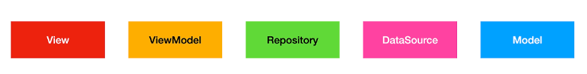

# mvvm_riverpot_test

A new Flutter project.

MVVM architecture, using Riverpot, Dependency Injection

- 출처: https://totally-developer.tistory.com/115 [Totally 개발자:티스토리]

## Getting Started

This project is a starting point for a Flutter application.

A few resources to get you started if this is your first Flutter project:

- [Lab: Write your first Flutter app](https://docs.flutter.dev/get-started/codelab)
- [Cookbook: Useful Flutter samples](https://docs.flutter.dev/cookbook)

For help getting started with Flutter development, view the
[online documentation](https://docs.flutter.dev/), which offers tutorials,
samples, guidance on mobile development, and a full API reference.


## Features

- MVVM architecture sample, using Provider, Dependency Injection
- https://jsonplaceholder.typicode.com/albums 이 예제 json url를 사용하여 데이터를 불러오고 화면에 출력한다.

## Usage


## Skill

MVVM architecture, Riverpot, Dependency Injection

## Plugin(pub.dev)

- flutter_riverpod: ^2.6.1
- http: ^1.3.0

## prior knowledge



| Component  | Description                             |
|:-----------|:----------------------------------------|
| View       | 사용자에게 보여지는 영역                           |
| ViewModel  | View의 상태를 관리하고 View의 비즈니스 로직을 담당        |
| Repository | 데이터 저장소라는 뜻으로 DataLayer인 DataSource에 접근 |
| DataSource | 데이터를 가져오는 영역(API, 로컬 DB)                |
| Model      | 데이터 설계                                  | 


### DataSource와 Service 비교

- `Service는 "비즈니스 로직"을 담당하고, DataSource는 "데이터 저장소"와 직접 통신하는 역할을 한다!`
- Service는 여러 DataSource에서 데이터를 가져와 가공하는 역할
- DataSource는 특정 데이터 저장소(API, DB 등)와 직접적으로 연결되어 데이터 CRUD를 수행

### 의존성 주입(Dependency Injection, DI)의 종류
의존성을 주입하는 방법은 크게 세 가지로 나눌 수 있습니다.
1. 생성자 주입(Constructor Injection): 생성자를 통해 의존 객체를 주입하는 방식입니다. 일반적으로 가장 많이 사용되며, 의존성이 필수적일 때 사용합니다.
2. Setter 주입(Setter Injection): Setter 메서드를 통해 의존 객체를 주입하는 방식입니다. 의존성이 선택적일 때 사용합니다.
3. 인터페이스 주입(Interface Injection): 인터페이스를 통해 의존 객체를 주입하는 방식입니다.

### AlbumViewModel 예시에서 의존성 주입이 어떻게 적용되었나?
```dart
class AlbumViewModel extends ChangeNotifier {
 final AlbumRepository _albumRepository;

 // 생성자에서 AlbumRepository를 주입 받음
 AlbumViewModel({required AlbumRepository albumRepository}) : _albumRepository = albumRepository;

// ... (나머지 코드)
}
```

위 코드에서 다음 사항을 확인할 수 있습니다.
1. AlbumRepository 의존성: AlbumViewModel은 AlbumRepository에 의존합니다. 즉, AlbumRepository 없이는 앨범 목록을 가져올 수 없습니다.
2. 생성자 주입: AlbumViewModel의 생성자(AlbumViewModel({required AlbumRepository albumRepository}))에서 AlbumRepository를 필수로 주입받도록 구현되어 있습니다. 이는 생성자 주입 방식입니다.
3. 외부에서 생성된 객체 주입: AlbumViewModel 내부에서 AlbumRepository 객체를 직접 생성하는 것이 아니라, 외부에서 생성된 AlbumRepository 객체를 생성자를 통해 전달받습니다.
4. 의존성 사용: AlbumViewModel에서는 주입 받은 _albumRepository를 사용하여 getAlbumList를 가져옵니다.


### main.dart에서 의존성 주입이 어떻게 사용되었나?

```dart
home: ChangeNotifierProvider(
    create: (_) => AlbumViewModel(albumRepository: AlbumRepository()),
    child: const AlbumView(),
  ),
```

1. AlbumViewModel 객체를 생성할 때, AlbumRepository() 객체를 직접 생성하여 AlbumViewModel 생성자의 인자로 전달합니다.
2. AlbumViewModel에서는 생성자를 통해 전달받은 albumRepository객체를 사용하게 됩니다.

### getAlbumList vs. fetchAlbums 변수명 선택 기준

- fetchAlbums
    - AlbumDataSource는 외부 데이터 소스 (예: API)를 호출하고, 응답을 파싱하여 앨범 목록을 가져옵니다.
    - 즉, 외부 데이터 소스와 관련된 구체적인 작업을 수행합니다.
    - 따라서 fetchAlbums()와 같이 외부 데이터 소스로부터 데이터를 가져오는 행위를 명확히 나타내는 메서드 이름을 사용하는 것이 적절합니다.
    1. "fetch"는 보통 네트워크나 데이터베이스 등 외부에서 데이터를 가져오는 행위에 초점을 맞추고 있습니다.
    2. "get"은 이미 가지고 있는 데이터를 반환한다는 뉘앙스를 줍니다. (로컬 캐시나 메모리 등에서)

- getAlbumList
    - AlbumRepository는 데이터를 제공하는 역할을 담당합니다.
    - AlbumRepository는 데이터를 어떤 방식으로 가져오는지는 추상화하고 있습니다.
    - 즉, AlbumRepository를 사용하는 쪽에서는 데이터가 어디에서 어떻게 오는지 알 필요 없이, 단순히 getAlbumList() 메서드를 통해 앨범 목록을 요청하면 됩니다.
    - 따라서 getAlbumList()는 데이터를 가져오는 행위보다는 데이터를 얻는다는 추상적인 개념을 나타내는 것이 적절합니다.
    1. "앨범 목록을 얻는다"라는 추상적인 행위를 나타내므로 'fetch'가 아닌 'get'을 사용하였음

- AlbumRepository는 getAlbumList라는 추상적인 메서드를 사용(데이터가 어디서 어떻게 오는지 알 필요 없음)하고,
- AlbumDataSource는 fetchAlbums와 같이 구체적인 데이터 가져오기 작업을 수행하는 메서드를 사용하는 것이 적절합니다.

## Layout


## Setps

models -> data_sources -> repositories -> view_models -> views -> main

### Directory structure

```
lib/
├── data/                  # 데이터 관련
│   ├── models/            # 데이터 모델
│   │   └── album.dart
│   ├── data_sources/       # 데이터 소스 (API, 로컬 DB)
│   │   └── album_data_source.dart
│   └── repositories/      # 데이터 저장소 (Repository)
│       └── album_repository.dart
├── view_models/            # 뷰 모델
│   └── album_viewmodel.dart
├── views/                 # UI (View)
│   └── album_view.dart
└── main.dart              # 앱 시작점
```

### add plugins and assets in pubspec.yaml, `pub get`

```yaml
dependencies:
  flutter_riverpod: ^2.6.1
  http: ^1.3.0
```

### configuring native setting


### implement album model

- Album 데이터 모델을 정의합니다.

- /lib/data/models/album.dart
```dart
class Album {
   int? userId;
   int? id;
   String? title;

   Album({this.userId, this.id, this.title});

   factory Album.fromJson(Map<String, dynamic> json) {
      return Album(userId: json['userId'], id: json['id'], title: json['title']);
   }
}
```


### implement lib/data/data_sources/album_data_source

- 외부 데이터 소스(API)와 통신하여 데이터를 가져옵니다. albumDataSourceProvider를 통해 AlbumDataSource를 제공합니다.

- /lib/data/data_sources/album_data_source.dart
```dart
import 'dart:convert';
import 'dart:io';

import 'package:http/http.dart' as http;
import 'package:flutter_riverpod/flutter_riverpod.dart';
import 'package:mvvm_riverpot_test/data/models/album.dart';

// 외부 데이터 소스 (예: API) 와 직접 통신하는 역할을 담당합니다.
class AlbumDataSource {
  static const String _baseUrl = 'jsonplaceholder.typicode.com';
  static const String _albumsEndpoint = '/albums';

  // 외부 데이터 소스로부터 앨범 목록을 가져오므로 'fetch'를 사용하였음
  Future<List<Album>> fetchAlbums() async {
    final albumUrl = Uri.https(_baseUrl, _albumsEndpoint);
    try {
      final response = await http.get(albumUrl);

      if (response.statusCode != HttpStatus.ok) {
        throw Exception(
          'Failed to load albums: status code ${response.statusCode}',
        );
      }

      final responseBody = response.body;
      if (responseBody.isEmpty) {
        throw Exception('Response body is empty');
      }

      final List<Album> result =
      (jsonDecode(responseBody) as List)
          .map<Album>((json) => Album.fromJson(json))
          .toList();
      return result;
    } catch (e) {
      throw Exception('Failed to load albums: $e');
    }
  }
}
//AlbumDataSource 를 제공하기 위한 provider
final albumDataSourceProvider = Provider<AlbumDataSource>((ref) => AlbumDataSource());
```

#### provider를 riverpot으로 마이그레이션 작업

1. add final albumDataSourceProvider = Provider<AlbumDataSource>((ref) => AlbumDataSource());  //AlbumDataSource 를 제공하기 위한 provider

2. albumDataSourceProvider:
   - final albumDataSourceProvider = Provider<AlbumDataSource>((ref) => AlbumDataSource()); 이 부분이 핵심입니다.
   - Provider를 사용하여 AlbumDataSource의 인스턴스를 제공합니다.
   - 이제 이 albumDataSourceProvider를 통해 어디서든 AlbumDataSource 인스턴스를 쉽게 얻을 수 있습니다.
   - ref는 Provider에서 제공하는 객체로, 다른 provider와 통신할 때 사용할 수 있습니다.
   - 이 provider는 단순히 AlbumDataSource 인스턴스를 생성하고 제공하는 역할을 합니다.


### implement album_repository

- 데이터 소스를 추상화하고, albumRepositoryProvider를 통해 AlbumRepository를 제공합니다.
  - AlbumRepository는 데이터를 제공하는 역할을 담당합니다.
  - 생성자에 의존성 주입(Dependency Injection, DI) 사용
  - _DataSource.fetchAlbums()를 호출하여 앨범 목록을 가져옴.

- /lib/data/repositories/album_repository.dart
```dart
import 'package:flutter_riverpod/flutter_riverpod.dart';
import 'package:mvvm_riverpot_test/data/data_sources/album_data_source.dart';
import 'package:mvvm_riverpot_test/data/models/album.dart';

// 데이터 저장소라는 뜻으로 DataLayer인 DataSource에 접근
class AlbumRepository {
  final AlbumDataSource _albumDataSource;

  AlbumRepository({required AlbumDataSource albumDataSource})
          : _albumDataSource = albumDataSource;

  // "앨범 목록을 얻는다"라는 추상적인 행위를 나타내므로 'fetch'가 아닌 'get'을 사용하였음
  Future<List<Album>> getAlbumList() async {
    return await _albumDataSource.fetchAlbums();
  }
}

// AlbumRepository를 제공하기 위한 provider
final albumRepositoryProvider = Provider<AlbumRepository>((ref) {
  final albumDataSource = ref.watch(albumDataSourceProvider);
  return AlbumRepository(albumDataSource: albumDataSource);
});
```

#### provider를 riverpot으로 마이그레이션 작업

1. add final albumRepositoryProvider = Provider<AlbumRepository>((ref) {
   final albumDataSource = ref.watch(albumDataSourceProvider);
   return AlbumRepository(albumDataSource: albumDataSource);
   });  // AlbumRepository를 제공하기 위한 provider

2. albumRepositoryProvider:
   - Provider<AlbumRepository>를 사용하여 AlbumRepository의 인스턴스를 제공합니다.
   - final albumDataSource = ref.watch(albumDataSourceProvider); 이 부분이 핵심입니다.
     * ref.watch(albumDataSourceProvider)를 사용하여 albumDataSourceProvider가 제공하는 AlbumDataSource 인스턴스를 가져옵니다.
     * Riverpod에서는 watch를 사용하면 해당 provider의 값이 변경될 때마다 의존하는 provider를 재빌드 합니다.
     * 이 코드는 albumDataSourceProvider에 의존하고 있음을 명시적으로 나타냅니다. 즉 albumDataSourceProvider에 변화가 있을 시 재빌드 된다는 의미입니다.
   - return AlbumRepository(albumDataSource: albumDataSource);
     * 가져온 AlbumDataSource 인스턴스를 생성자에 넣어 AlbumRepository 인스턴스를 생성하고 반환합니다.


### implement album_viewmodel

- 뷰의 상태를 관리하고 비즈니스 로직을 담당합니다. albumViewModelProvider를 통해 AlbumViewModel을 제공합니다.
  - Riverpod에서는 Notifier 혹은 AsyncNotifier를 사용하여 상태를 관리합니다.
  - AsyncNotifier<List<Album>>을 상속하여 비동기적으로 List<Album>을 관리하는 상태임을 나타냅니다.

- /lib/view_models/album_viewmodel.dart
```dart
import 'package:flutter_riverpod/flutter_riverpod.dart';
import 'package:mvvm_riverpot_test/data/models/album.dart';
import 'package:mvvm_riverpot_test/data/repositories/album_repository.dart';

// View의 상태를 관리하고 View의 비즈니스 로직을 담당
class AlbumViewModel extends AsyncNotifier<List<Album>> {
  //AsyncNotifier 클래스 이므로 더이상 AlbumRepository 클래스를 주입받을 필요가 없음
  @override
  Future<List<Album>> build() async {
    //초기 데이터가 필요할 경우 이곳에서 데이터를 호출하면 됨
    return await _getAlbumList();
  }

  //앨범 목록을 가져오는 메서드
  Future<List<Album>> _getAlbumList() async {
    try {
      //ref.watch가 아닌 ref.read를 사용하였음.
      //ref.watch는 값이 변경될 시 마다 위젯을 다시 빌드하지만 ref.read는 한번만 실행됨
      final albumRepository = ref.read(albumRepositoryProvider);
      return await albumRepository.getAlbumList();
    } catch (e) {
      return []; // 에러 발생 시 빈 리스트로 초기화
    }
  }

  Future<void> refreshAlbumList() async {
    state = const AsyncValue.loading();
    state = await AsyncValue.guard(_getAlbumList);
  }
}

// AlbumViewModel을 제공하기 위한 provider
final albumViewModelProvider =
    AsyncNotifierProvider<AlbumViewModel, List<Album>>(() => AlbumViewModel());
```

#### provider를 riverpot으로 마이그레이션 작업

1. class AlbumViewModel extends AsyncNotifier<List<Album>>
   - AsyncNotifier<List<Album>>을 상속하여 비동기적으로 List<Album>을 관리하는 상태임을 나타냅니다.
2. @override Future<List<Album>> build() async
   - 이 메서드는 AsyncNotifier의 핵심 메서드로, 초기 상태를 정의하고 비동기적으로 데이터를 가져오는 역할을 합니다.
   - build 메소드는 state에 의해 위젯을 빌드하고 생성된 provider의 초기 상태를 설정합니다.
   - 이 경우에는 _getAlbumList 메소드를 호출하여 초기 앨범 리스트를 가져와서 리턴합니다.
    > state의 타입은 AsyncValue<List<Album>> 이고 이것은 다음의 상태를 가질 수 있습니다.
    > - Data : 데이터가 존재할 경우
    > - Loading : 로딩 중일 경우
    > - Error : 에러가 발생할 경우
3. _getAlbumList()
   - final albumRepository = ref.read(albumRepositoryProvider);: ref.read()를 사용하여 albumRepositoryProvider를 통해 AlbumRepository 인스턴스를 가져옵니다.
    > ref.read와 ref.watch의 차이점
    > - ref.read(): Provider의 값을 읽어오지만, provider의 값이 변경되어도 위젯을 다시 빌드하지 않습니다. 즉 한번만 값을 읽어옵니다.
    > - ref.watch(): Provider의 값을 읽어오고, 값이 변경될 때마다 해당 위젯을 다시 빌드합니다.
    > - 이 메서드에서는 한번만 앨범 리스트를 가져오면 되기 때문에 ref.read()를 사용했습니다.
4. refreshAlbumList()
   - 리스트를 새로고침 하는 메소드입니다.
   - state를 AsyncValue.loading()으로 변경하여 로딩중임을 표시하고
   - state를 AsyncValue.guard(_getAlbumList)로 변경하여 앨범 리스트를 새로 가져옵니다.
5. add final albumViewModelProvider = AsyncNotifierProvider<AlbumViewModel, List<Album>>(() => AlbumViewModel());
   - AsyncNotifierProvider를 사용하여 AlbumViewModel 인스턴스를 제공합니다.
   - 이 provider는 앨범 목록 (List<Album>)의 비동기 상태를 관리합니다


### implement album_view

- 사용자에게 앨범 목록을 보여주는 뷰입니다. albumViewModelProvider를 구독하여 데이터를 가져오고 화면에 표시합니다.
  - 뷰 모델을 사용하여 앨범 목록을 가져옴.
  - ConsumerWidget 또는 ConsumerStatefulWidget 사용
  - 새로고침 버튼

- /lib/views/album_view.dart
```dart
import 'package:flutter/material.dart';
import 'package:flutter_riverpod/flutter_riverpod.dart';
import 'package:mvvm_riverpot_test/data/models/album.dart';
import 'package:mvvm_riverpot_test/view_models/album_viewmodel.dart';

// 사용자에게 보여지는 영역
class AlbumView extends ConsumerWidget {
  const AlbumView({Key? key}) : super(key: key);

  @override
  Widget build(BuildContext context, WidgetRef ref) {
    final albumState = ref.watch(albumViewModelProvider);
    return Scaffold(
      appBar: AppBar(
        title: const Text('Album List'),
        actions: [
          IconButton(
            onPressed: () {
              //새로고침 버튼을 눌렀을 시 리스트를 새로고침함
              ref.read(albumViewModelProvider.notifier).refreshAlbumList();
            },
            icon: const Icon(Icons.refresh),
          ),
        ],
      ),
      body: albumState.when(
        data: (albums) {
          return _buildAlbumList(albums);
        },
        loading: () => const Center(child: CircularProgressIndicator()),
        error: (error, stack) => Center(child: Text('Error: $error')),
      ),
    );
  }

  Widget _buildAlbumList(List<Album> albums) {
    return ListView.builder(
      itemCount: albums.length,
      itemBuilder: (context, index) {
        final album = albums[index];
        return ListTile(title: Text('${album.id}: ${album.title}'));
      },
    );
  }
}
```

#### provider를 riverpot으로 마이그레이션 작업

1. class AlbumView extends ConsumerWidget
   - StatefulWidget에서 ConsumerWidget으로 변경되었습니다. 
   - ConsumerWidget은 Riverpod에서 제공하는 위젯으로, provider를 구독하고 상태 변화를 감지할 수 있습니다.
2. Widget build(BuildContext context, WidgetRef ref)
   - 이전의 build 메서드와 다르게 WidgetRef ref라는 파라미터를 받습니다. 
   - WidgetRef는 provider에 접근하고 상태를 감시하는 데 사용됩니다.
3. final albumState = ref.watch(albumViewModelProvider)
   - ref.watch(albumViewModelProvider)를 사용하여 albumViewModelProvider가 관리하는 상태를 구독합니다.
   - albumViewModelProvider는 AsyncNotifierProvider이므로, albumState는 AsyncValue<List<Album>> 타입입니다.
     > albumState는 데이터의 현재 상태를 나타내는 객체로, 다음과 같은 정보를 포함합니다.
     >  - 데이터(data): 만약 요청이 성공적으로 완료되어 데이터를 반환한 경우, 데이터가 포함됩니다.
     >  - 로딩 상태(loading): 만약 요청이 진행 중인 경우, 로딩 상태를 나타냅니다.
     >  - 오류(error): 만약 요청이 실패하여 오류가 발생한 경우, 오류 정보가 포함됩니다.
4. albumState.when(...)
   - albumState의 상태에 따라 다른 위젯을 보여주는 데 사용됩니다.
     >  - data: (albums) { ... }: 데이터가 성공적으로 로드된 경우, _buildAlbumList 메서드를 호출하여 앨범 목록을 보여줍니다.
     >  - loading: () => const Center(child: CircularProgressIndicator()): 데이터가 로딩 중인 경우, 로딩 인디케이터를 표시합니다.
     >  - error: (error, stack) => Center(child: Text('Error: $error')): 데이터 로드에 실패한 경우, 오류 메시지를 표시합니다.
5. actions: 앱바에 새로고침 버튼을 추가했습니다.
6. ref.read(albumViewModelProvider.notifier).refreshAlbumList()
   - 새로고침 버튼을 누를 시 refreshAlbumList 메소드를 호출하도록 했습니다.


### implement main.dart

-  Riverpod을 사용하기 위해 ProviderScope로 앱을 감싸야 합니다.
  - AlbumView를 home으로 설정합니다.

- /lib/main.dart
```dart
import 'package:flutter/material.dart';
import 'package:flutter_riverpod/flutter_riverpod.dart';
import 'package:mvvm_riverpot_test/views/album_view.dart';

void main() {
  // Riverpod을 사용하려면 ProviderScope로 앱을 감싸야 합니다.
  runApp(const ProviderScope(child: MyApp()));
}

class MyApp extends StatelessWidget {
  const MyApp({Key? key}) : super(key: key);

  @override
  Widget build(BuildContext context) {
    return const MaterialApp(home: AlbumView());
  }
}
```

#### provider를 riverpot으로 마이그레이션 작업

1. runApp(const ProviderScope(child: MyApp()));
   - 앱을 ProviderScope로 감쌌습니다. ProviderScope는 Riverpod을 사용할 수 있도록 앱의 최상위에서 provider를 제공하는 역할을 합니다. 
2. home: AlbumView()
   - ChangeNotifierProvider를 제거하고, AlbumView를 직접 home으로 사용합니다. 
   - 더 이상 AlbumViewModel과 AlbumRepository를 Provider를 통해 제공할 필요가 없습니다. 
   - 왜냐하면 각각의 provider를 통해 제공하고 있기 때문입니다.