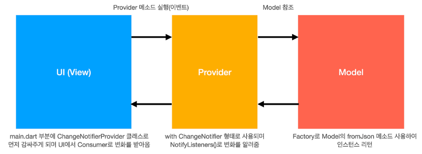

# provider_test

state management: Provider

- Flutter 3.10 이후 Riverpod이 더 선호됨 (Provider보다 의존성이 더 낮음)

- 출처: https://totally-developer.tistory.com/83 [Totally 개발자:티스토리]

## Getting Started

This project is a starting point for a Flutter application.

A few resources to get you started if this is your first Flutter project:

- [Lab: Write your first Flutter app](https://docs.flutter.dev/get-started/codelab)
- [Cookbook: Useful Flutter samples](https://docs.flutter.dev/cookbook)

For help getting started with Flutter development, view the
[online documentation](https://docs.flutter.dev/), which offers tutorials,
samples, guidance on mobile development, and a full API reference.

## Features

https://jsonplaceholder.typicode.com/albums
이 예제 json url를 사용하여 데이터를 불러오고 화면에 출력한다.

## Skill

state management: Provider

## Plugin(pub.dev)

dependencies:
provider: ^6.1.2
http: ^1.3.0
get_it: ^8.0.3

## prior knowledge

### 의존성 주입(Dependency Injection):
GetIt을 사용하여 의존성을 주입하는 것은, 코드의 결합도를 낮추는 데 매우 효과적입니다.
main.dart는 AlbumBloc, AlbumRepository, AlbumApiProvider의 구현에 대해 알 필요 없이,
GetIt을 통해 필요한 인스턴스를 제공받을 수 있습니다.

### 캡슐화(Encapsulation):
albums_model.dart와 album_model.dart는 API 응답 데이터를 모델링하는 데만 집중합니다.
api_provider.dart는 API 호출과 응답 데이터 처리, 모델 변환 등에만 집중합니다.
각 파일의 역할을 명확하게 분리하는 것은 좋은 프로그래밍 습관입니다.

### 관심사 분리(Separation of Concerns):
각 파일이 자신의 역할에만 집중하도록 설계하는 것은 코드의 가독성, 재사용성, 유지보수성을 크게 향상시킵니다.

### Provider

> 상태 관리 패턴 중 하나인 Provider에 대해 자세히 설명해줘


1. 상태(State)란?
   Flutter에서 **상태(State)**란 UI가 유지해야 하는 데이터를 의미합니다.
   예를 들어, 버튼을 클릭하면 화면의 텍스트가 변경되는 경우, 이 텍스트의 값이 상태입니다.

Flutter는 StatefulWidget을 통해 상태를 관리할 수 있지만, 복잡한 애플리케이션에서는 전역 상태 관리가 필요합니다.
이때 Provider 패턴을 사용하면 효율적으로 상태를 관리할 수 있습니다.

2. Provider란?
   Provider는 Flutter에서 공식적으로 권장하는 상태 관리 패턴 중 하나로,
   단순하고 성능이 뛰어나며, 코드가 깔끔해지는 장점이 있습니다.

🔹 Provider는 ChangeNotifier와 결합하여 구독(Subscribe) 방식으로 UI를 자동 업데이트합니다.
🔹 상태를 전역적으로 공유할 수 있어, 여러 위젯에서 동일한 데이터를 쉽게 사용 가능합니다.
🔹 BuildContext를 사용하지 않고도 상태를 관리할 수 있어 성능 최적화가 가능합니다.

3. Provider의 핵심 개념
   ✅ 1) ChangeNotifier
   ChangeNotifier는 상태 변경을 감지하고, UI를 다시 빌드하도록 알리는 역할을 합니다.
   **notifyListeners()**를 호출하면 변경 사항이 UI에 반영됩니다.
   ✅ 2) ChangeNotifierProvider
   Provider를 등록하는 역할을 합니다.
   MultiProvider를 사용하면 여러 개의 Provider를 등록할 수 있습니다.
   ✅ 3) Consumer
   Provider로부터 데이터를 구독하여, 상태가 변경되면 UI를 자동으로 업데이트합니다.

4. Provider의 장점과 단점
   ✅ 장점
   ✔ Flutter 공식 상태 관리 라이브러리로 신뢰성이 높음
   ✔ 코드가 깔끔하고 가독성이 뛰어남
   ✔ ChangeNotifier 기반이라 이해하기 쉬움
   ✔ 전역 상태 관리에 강력함 (특히, 여러 위젯에서 데이터를 공유할 때 유용)
   ✔ Consumer, Selector 등을 사용해 UI 업데이트 최적화 가능

   ❌ 단점
   ✖ 규모가 매우 커지면 코드가 복잡해질 수 있음
   ✖ Flutter 3.10 이후 Riverpod이 더 선호됨 (Provider보다 의존성이 더 낮음)
   ✖ 객체 수명이 자동 관리되지 않음, 직접 dispose() 처리가 필요할 수도 있음

### main.dart의 역할: main.dart는 애플리케이션의 진입점이며, 주로 다음과 같은 역할을 합니다.
- GetIt 초기화 및 의존성 등록 (AlbumBloc, AlbumRepository, AlbumApiProvider 등)
- 최상위 위젯 (MyApp) 구성 및 실행
- 그 외 애플리케이션의 전반적인 설정 및 초기화


## Layout

- AlbumView, ListView

## Setps

album_model -> album_provider(http) -> album_view -> main

### modify pubspec.yaml
dependencies:
  provider: ^6.1.2
  http: ^1.3.0
  get_it: ^8.0.3

### json data
https://jsonplaceholder.typicode.com/albums
```json
[
  {
    "userId": 1,
    "id": 1,
    "title": "quidem molestiae enim"
  },
  {
    "userId": 1,
    "id": 2,
    "title": "sunt qui excepturi placeat culpa"
  }
]
```

### implement album_model

- /lib/models/album.dart
```dart
class Album {
  int? userId;
  int? id;
  String? title;

  Album({this.userId, this.id, this.title});

  factory Album.fromJson(Map<String, dynamic> json) =>
      Album(userId: json['userId'], id: json['id'], title: json['title']);
}
```

### implement album_provider

- ChangeNotifier를 상속받아 상태 관리를 위한 클래스를 만든다.
- **notifyListeners()**를 호출하면 변경 사항이 UI에 반영된다.

- /lib/providers/album_provider.dart
```dart
import 'dart:convert';

import 'package:flutter/material.dart';
import 'package:http/http.dart' as http;
import 'package:provider_test/models/album_model.dart';

/// 상태를 관리하는 클래스
///
/// ChangeNotifier를 상속받아 상태 관리를 위한 클래스를 만든다.
class AlbumProvider with ChangeNotifier {
  final List<Album> _albums = [];

  List<Album> getAlbums() {
    _fetchAlbums();
    return _albums;
  }

  void _fetchAlbums() async {
    final response = await http.get(
      Uri.parse('https://jsonplaceholder.typicode.com/albums'),
    );
    final List<Album> result =
        jsonDecode(
          response.body,
        ).map<Album>((json) => Album.fromJson(json)).toList();

    _albums.clear();
    _albums.addAll(result);
    notifyListeners(); // UI 업데이트
  }
}
```

### implement album_view

- Provider 사용하기
- 이제 Consumer 또는 Provider.of를 사용하여 UI에서 상태를 사용할 수 있다.

- /lib/views/album_view.dart
```dart
import 'package:flutter/material.dart';
import 'package:provider/provider.dart';
import 'package:provider_test/models/album_model.dart';
import 'package:provider_test/providers/album_provider.dart';

/// Provider 사용하기
///
/// Consumer<AlbumProvider>: AlbumProvider 상태를 구독하고 UI를 자동 업데이트한다.
class AlbumView extends StatefulWidget {
  const AlbumView({super.key});

  @override
  State<AlbumView> createState() => _AlbumViewState();
}

class _AlbumViewState extends State<AlbumView> {
  late List<Album> _albums;

  @override
  Widget build(BuildContext context) {
    return Scaffold(
      appBar: AppBar(title: const Text('Albums')),
      body: Consumer<AlbumProvider>( // AlbumProvider 상태를 구독하고 UI를 자동 업데이트한다.
        builder: (context, provider, child) {
          _albums = provider.getAlbums();
          return ListView.builder(
            itemCount: _albums.length,
            itemBuilder: (BuildContext context, int index) {
              return Container(
                padding: const EdgeInsets.all(16.0),
                child: Text('${_albums[index].id}: ${_albums[index].title}'),
              );
            },
          );
        },
      ),
    );
  }
}

```


### implement main

- Provider 등록하기
- ChangeNotifierProvider를 사용하여 Provider를 등록한다.

```dart
import 'package:flutter/material.dart';
import 'package:provider/provider.dart';
import 'package:provider_test/providers/album_provider.dart';
import 'package:provider_test/views/album_view.dart';

void main() {
  runApp(const MyApp());
}

/// Provider 등록하기
///
/// ChangeNotifierProvider를 사용하여 Provider를 등록한다.
class MyApp extends StatelessWidget {
  const MyApp({super.key});

  @override
  Widget build(BuildContext context) {
    return MaterialApp(
      home: ChangeNotifierProvider<AlbumProvider>(
        create: (context) => AlbumProvider(), // AlbumProvider 인스턴스 생성
        child: const AlbumView(),
      ),
    );
  }
}

```