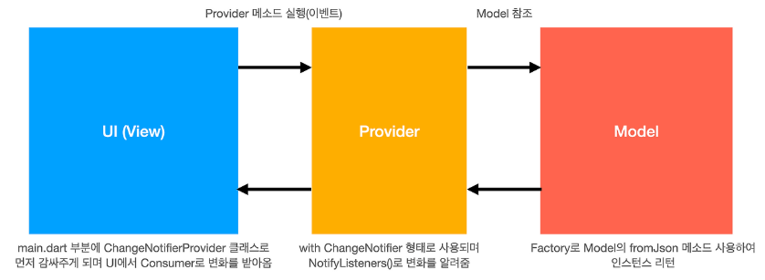
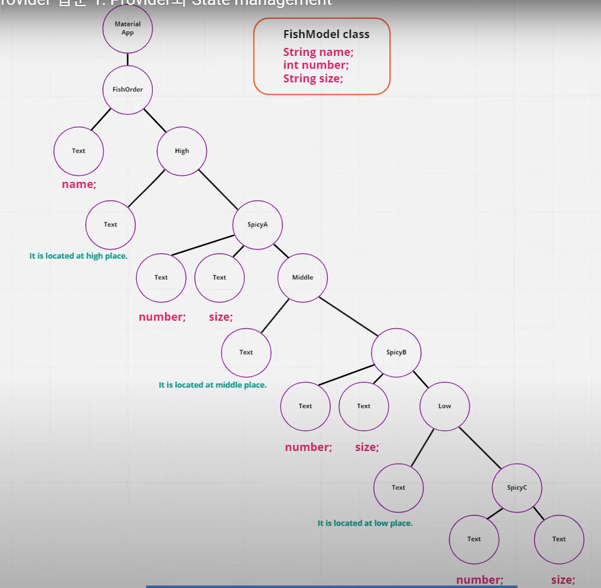

# provider_test2

state management: Provider

- Flutter 3.10 이후 Riverpod이 더 선호됨 (Provider보다 의존성이 더 낮음)

- 출처: https://youtu.be/-3iD7f3e_SU?si=glqiRhZwMTzNWKou

## Getting Started

This project is a starting point for a Flutter application.

A few resources to get you started if this is your first Flutter project:

- [Lab: Write your first Flutter app](https://docs.flutter.dev/get-started/codelab)
- [Cookbook: Useful Flutter samples](https://docs.flutter.dev/cookbook)

For help getting started with Flutter development, view the
[online documentation](https://docs.flutter.dev/), which offers tutorials,
samples, guidance on mobile development, and a full API reference.


## Skill

state management: Provider

## Plugin(pub.dev)

dependencies:
provider: ^6.1.2

## prior knowledge

### Provider



1. 상태(State)란?

Flutter에서 **상태(State)**란 UI가 유지해야 하는 데이터를 의미합니다.
예를 들어, 버튼을 클릭하면 화면의 텍스트가 변경되는 경우, 이 텍스트의 값이 상태입니다.

Flutter는 StatefulWidget을 통해 상태를 관리할 수 있지만, 복잡한 애플리케이션에서는 전역 상태 관리가 필요합니다.
이때 Provider 패턴을 사용하면 효율적으로 상태를 관리할 수 있습니다.

2. Provider란?

Provider는 Flutter에서 공식적으로 권장하는 상태 관리 패턴 중 하나로,
단순하고 성능이 뛰어나며, 코드가 깔끔해지는 장점이 있습니다.

- Provider는 ChangeNotifier와 결합하여 구독(Subscribe) 방식으로 UI를 자동 업데이트합니다.
- 상태를 전역적으로 공유할 수 있어, 여러 위젯에서 동일한 데이터를 쉽게 사용 가능합니다.
- BuildContext를 사용하지 않고도 상태를 관리할 수 있어 성능 최적화가 가능합니다.

3. Provider의 핵심 개념
    1) ChangeNotifier
        - ChangeNotifier는 상태 변경을 감지하고, UI를 다시 빌드하도록 알리는 역할을 합니다.
        - **notifyListeners()**를 호출하면 변경 사항이 UI에 반영됩니다.
    2) ChangeNotifierProvider
        - Provider를 등록하는 역할을 합니다.
        - MultiProvider를 사용하면 여러 개의 Provider를 등록할 수 있습니다.
    3) Consumer
        - Provider로부터 데이터를 구독하여, 상태가 변경되면 UI를 자동으로 업데이트합니다.

4. Provider의 장점과 단점

   ✅ 장점

   ✔ Flutter 공식 상태 관리 라이브러리로 신뢰성이 높음
   ✔ 코드가 깔끔하고 가독성이 뛰어남
   ✔ ChangeNotifier 기반이라 이해하기 쉬움
   ✔ 전역 상태 관리에 강력함 (특히, 여러 위젯에서 데이터를 공유할 때 유용)
   ✔ Consumer, Selector 등을 사용해 UI 업데이트 최적화 가능

   ❌ 단점

   ✖ 규모가 매우 커지면 코드가 복잡해질 수 있음
   ✖ Flutter 3.10 이후 Riverpod이 더 선호됨 (Provider보다 의존성이 더 낮음)
   ✖ 객체 수명이 자동 관리되지 않음, 직접 dispose() 처리가 필요할 수도 있음

### main.dart의 역할: main.dart는 애플리케이션의 진입점이며, 주로 다음과 같은 역할을 합니다.

- GetIt 초기화 및 의존성 등록 (AlbumBloc, AlbumRepository, AlbumApiProvider 등)
- 최상위 위젯 (MyApp) 구성 및 실행
- 그 외 애플리케이션의 전반적인 설정 및 초기화


## Setps



### modify pubspec.yaml
dependencies:
provider: ^6.1.2

### implement fish_model

- /lib/models/fish_model.dart
```dart
import 'package:flutter/material.dart';

class FishModel with ChangeNotifier {
  final String name;
  int count;
  final String size;

  FishModel({required this.name, required this.count, required this.size});

  void increaseCount() {
    count++;
    notifyListeners();
  }
}

```

### implement main

```dart
import 'package:flutter/material.dart';

void main() {
  runApp(const MyApp());
}

class MyApp extends StatelessWidget {
  const MyApp({super.key});

  @override
  Widget build(BuildContext context) {
    return MaterialApp(home: FishOrder());
  }
}

class FishOrder extends StatelessWidget {
  const FishOrder({super.key});

  @override
  Widget build(BuildContext context) {
    return Scaffold(
      appBar: AppBar(title: Text("Fish Order")),
      body: Center(
        child: Column(
          children: [
            Text('Fish name', style: TextStyle(fontSize: 16)),
            const SizedBox(height: 20),
            High(),
          ],
        ),
      ),
    );
  }
}

class High extends StatelessWidget {
  const High({super.key});

  @override
  Widget build(BuildContext context) {
    return Column(
      children: [
        Text('SpiceA is located at high place', style: TextStyle(fontSize: 16)),
        const SizedBox(height: 20),
        SpiceA(),
      ],
    );
  }
}

class SpiceA extends StatelessWidget {
  const SpiceA({super.key});

  @override
  Widget build(BuildContext context) {
    return Column(
      children: [
        Text(
          'Fish count',
          style: TextStyle(
            fontSize: 16,
            color: Colors.red,
            fontWeight: FontWeight.bold,
          ),
        ),
        Text(
          'Fish size',
          style: TextStyle(
            fontSize: 16,
            color: Colors.red,
            fontWeight: FontWeight.bold,
          ),
        ),
        const SizedBox(height: 20),
        Middle(),
      ],
    );
  }
}

class Middle extends StatelessWidget {
  const Middle({super.key});

  @override
  Widget build(BuildContext context) {
    return Column(
      children: [
        Text(
          'SpiceB is located at middle place',
          style: TextStyle(fontSize: 16),
        ),
        const SizedBox(height: 20),
        SpiceB(),
      ],
    );
  }
}

class SpiceB extends StatelessWidget {
  const SpiceB({super.key});

  @override
  Widget build(BuildContext context) {
    return Column(
      children: [
        Text(
          'Fish count',
          style: TextStyle(
            fontSize: 16,
            color: Colors.red,
            fontWeight: FontWeight.bold,
          ),
        ),
        Text(
          'Fish size',
          style: TextStyle(
            fontSize: 16,
            color: Colors.red,
            fontWeight: FontWeight.bold,
          ),
        ),
        const SizedBox(height: 20),
        Low(),
      ],
    );
  }
}

class Low extends StatelessWidget {
  const Low({super.key});

  @override
  Widget build(BuildContext context) {
    return Column(
      children: [
        Text('SpiceC is located at Low place', style: TextStyle(fontSize: 16)),
        const SizedBox(height: 20),
        SpiceC(),
      ],
    );
  }
}

class SpiceC extends StatelessWidget {
  const SpiceC({super.key});

  @override
  Widget build(BuildContext context) {
    return Column(
      children: [
        Text(
          'Fish count',
          style: TextStyle(
            fontSize: 16,
            color: Colors.red,
            fontWeight: FontWeight.bold,
          ),
        ),
        Text(
          'Fish size',
          style: TextStyle(
            fontSize: 16,
            color: Colors.red,
            fontWeight: FontWeight.bold,
          ),
        ),
      ],
    );
  }
}


```

### implement provider in main

- add Provider()
- add Provider.of<FishModel>(context)

```dart
import 'package:flutter/material.dart';
import 'package:provider/provider.dart';
import 'package:provider_test2/models/fish_model.dart';

void main() {
  runApp(const MyApp());
}

class MyApp extends StatelessWidget {
  const MyApp({super.key});

  @override
  Widget build(BuildContext context) {
    return Provider(
      create:
          (BuildContext context) =>
              FishModel(name: 'Salmon', count: 10, size: 'big'),
      child: MaterialApp(home: FishOrder()),
    );
  }
}

class FishOrder extends StatelessWidget {
  const FishOrder({super.key});

  @override
  Widget build(BuildContext context) {
    return Scaffold(
      appBar: AppBar(title: Text("Fish Order")),
      body: Center(
        child: Column(
          children: [
            Text(
              'Fish name: ${Provider.of<FishModel>(context).name}',
              style: TextStyle(fontSize: 16),
            ),
            const SizedBox(height: 20),
            High(),
          ],
        ),
      ),
    );
  }
}

class High extends StatelessWidget {
  const High({super.key});

  @override
  Widget build(BuildContext context) {
    return Column(
      children: [
        Text('SpiceA is located at high place', style: TextStyle(fontSize: 16)),
        const SizedBox(height: 20),
        SpiceA(),
      ],
    );
  }
}

class SpiceA extends StatelessWidget {
  const SpiceA({super.key});

  @override
  Widget build(BuildContext context) {
    return Column(
      children: [
        Text(
          'Fish count: ${Provider.of<FishModel>(context).count}',
          style: TextStyle(
            fontSize: 16,
            color: Colors.red,
            fontWeight: FontWeight.bold,
          ),
        ),
        Text(
          'Fish size: ${Provider.of<FishModel>(context).size}',
          style: TextStyle(
            fontSize: 16,
            color: Colors.red,
            fontWeight: FontWeight.bold,
          ),
        ),
        const SizedBox(height: 20),
        Middle(),
      ],
    );
  }
}

class Middle extends StatelessWidget {
  const Middle({super.key});

  @override
  Widget build(BuildContext context) {
    return Column(
      children: [
        Text(
          'SpiceB is located at middle place',
          style: TextStyle(fontSize: 16),
        ),
        const SizedBox(height: 20),
        SpiceB(),
      ],
    );
  }
}

class SpiceB extends StatelessWidget {
  const SpiceB({super.key});

  @override
  Widget build(BuildContext context) {
    return Column(
      children: [
        Text(
          'Fish count: ${Provider.of<FishModel>(context).count}',
          style: TextStyle(
            fontSize: 16,
            color: Colors.red,
            fontWeight: FontWeight.bold,
          ),
        ),
        Text(
          'Fish size: ${Provider.of<FishModel>(context).size}',
          style: TextStyle(
            fontSize: 16,
            color: Colors.red,
            fontWeight: FontWeight.bold,
          ),
        ),
        const SizedBox(height: 20),
        Low(),
      ],
    );
  }
}

class Low extends StatelessWidget {
  const Low({super.key});

  @override
  Widget build(BuildContext context) {
    return Column(
      children: [
        Text('SpiceC is located at Low place', style: TextStyle(fontSize: 16)),
        const SizedBox(height: 20),
        SpiceC(),
      ],
    );
  }
}

class SpiceC extends StatelessWidget {
  const SpiceC({super.key});

  @override
  Widget build(BuildContext context) {
    return Column(
      children: [
        Text(
          'Fish count: ${Provider.of<FishModel>(context).count}',
          style: TextStyle(
            fontSize: 16,
            color: Colors.red,
            fontWeight: FontWeight.bold,
          ),
        ),
        Text(
          'Fish size: ${Provider.of<FishModel>(context).size}',
          style: TextStyle(
            fontSize: 16,
            color: Colors.red,
            fontWeight: FontWeight.bold,
          ),
        ),
      ],
    );
  }
}

```

### implement ChangeNotifierProvider in main

- change Provider() -> ChangeNotifierProvider() in MyApp
- add Provider.of<FishModel>(context, listen: false).increaseCount(); in SpiceC

```dart
import 'package:flutter/material.dart';
import 'package:provider/provider.dart';
import 'package:provider_test2/models/fish_model.dart';

void main() {
  runApp(const MyApp());
}

class MyApp extends StatelessWidget {
  const MyApp({super.key});

  @override
  Widget build(BuildContext context) {
    return ChangeNotifierProvider(
      create:
          (BuildContext context) =>
              FishModel(name: 'Salmon', count: 10, size: 'big'),
      child: MaterialApp(home: FishOrder()),
    );
  }
}

class FishOrder extends StatelessWidget {
  const FishOrder({super.key});

  @override
  Widget build(BuildContext context) {
    return Scaffold(
      appBar: AppBar(title: Text("Fish Order")),
      body: Center(
        child: Column(
          children: [
            Text(
              'Fish name: ${Provider.of<FishModel>(context).name}',
              style: TextStyle(fontSize: 16),
            ),
            const SizedBox(height: 20),
            High(),
          ],
        ),
      ),
    );
  }
}

class High extends StatelessWidget {
  const High({super.key});

  @override
  Widget build(BuildContext context) {
    return Column(
      children: [
        Text('SpiceA is located at high place', style: TextStyle(fontSize: 16)),
        const SizedBox(height: 20),
        SpiceA(),
      ],
    );
  }
}

class SpiceA extends StatelessWidget {
  const SpiceA({super.key});

  @override
  Widget build(BuildContext context) {
    return Column(
      children: [
        Text(
          'Fish count: ${Provider.of<FishModel>(context).count}',
          style: TextStyle(
            fontSize: 16,
            color: Colors.red,
            fontWeight: FontWeight.bold,
          ),
        ),
        Text(
          'Fish size: ${Provider.of<FishModel>(context).size}',
          style: TextStyle(
            fontSize: 16,
            color: Colors.red,
            fontWeight: FontWeight.bold,
          ),
        ),
        const SizedBox(height: 20),
        Middle(),
      ],
    );
  }
}

class Middle extends StatelessWidget {
  const Middle({super.key});

  @override
  Widget build(BuildContext context) {
    return Column(
      children: [
        Text(
          'SpiceB is located at middle place',
          style: TextStyle(fontSize: 16),
        ),
        const SizedBox(height: 20),
        SpiceB(),
      ],
    );
  }
}

class SpiceB extends StatelessWidget {
  const SpiceB({super.key});

  @override
  Widget build(BuildContext context) {
    return Column(
      children: [
        Text(
          'Fish count: ${Provider.of<FishModel>(context).count}',
          style: TextStyle(
            fontSize: 16,
            color: Colors.red,
            fontWeight: FontWeight.bold,
          ),
        ),
        Text(
          'Fish size: ${Provider.of<FishModel>(context).size}',
          style: TextStyle(
            fontSize: 16,
            color: Colors.red,
            fontWeight: FontWeight.bold,
          ),
        ),
        const SizedBox(height: 20),
        Low(),
      ],
    );
  }
}

class Low extends StatelessWidget {
  const Low({super.key});

  @override
  Widget build(BuildContext context) {
    return Column(
      children: [
        Text('SpiceC is located at Low place', style: TextStyle(fontSize: 16)),
        const SizedBox(height: 20),
        SpiceC(),
      ],
    );
  }
}

class SpiceC extends StatelessWidget {
  const SpiceC({super.key});

  @override
  Widget build(BuildContext context) {
    return Column(
      children: [
        Text(
          'Fish count: ${Provider.of<FishModel>(context).count}',
          style: TextStyle(
            fontSize: 16,
            color: Colors.red,
            fontWeight: FontWeight.bold,
          ),
        ),
        Text(
          'Fish size: ${Provider.of<FishModel>(context).size}',
          style: TextStyle(
            fontSize: 16,
            color: Colors.red,
            fontWeight: FontWeight.bold,
          ),
        ),
        const SizedBox(height: 20),
        ElevatedButton(
          onPressed: () {
            Provider.of<FishModel>(context, listen: false).increaseCount();
          },
          child: Text('Increase Fish Count'),
        ),
      ],
    );
  }
}

```

